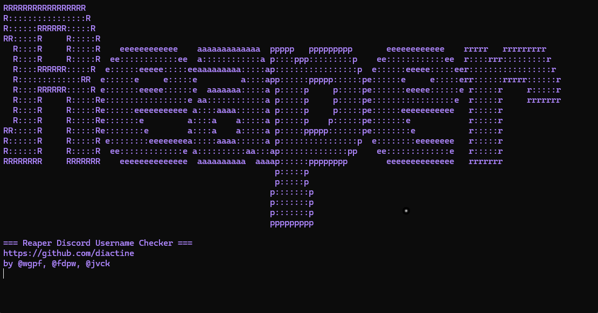

# reaper checker



checks discord usernames. put names in names.txt (one per line), run the script, pick option 2 or 3. thats it.

if names.txt is empty itll ask how many letters you want and generate all combos (3 = aaa to zzz etc).

proxies go in proxies.txt. if that file is empty it scrapes some for you. bad proxies get removed automatically.

when you start the checker it asks for a discord webhook. if you paste one in, every valid (available) username gets sent there as a message like: `username` is available. you can leave it blank if you dont want that.

## files

- `names.txt` - usernames to check (create it or leave empty to generate)
- `proxies.txt` - one proxy per line (ip:port). empty = auto scrape
- `results/hits.txt` - valid names get written here

## how to run

```
pip install requests colorama
python reaper_checker.py
```

then pick:
1. discord (opens invite)
2. start checker (normal speed)
3. start checker fast (multiple at once)

## credits

- https://github.com/wgfn
- by @wgpf, @fdpw, @jvck

discord: https://discord.gg/XWbjStSz5b
